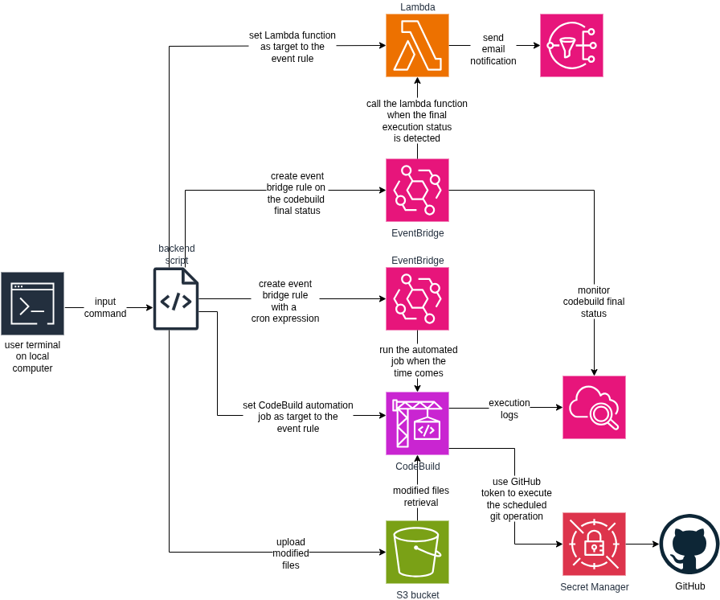

# 🕐 gits - Git Scheduler

[](https://python.org)
[](https://www.gnu.org/software/bash/)

> A powerful event-driven serverless command-line tool to schedule Git commands for execution at specified times

## 📋 Table of Contents

- [Overview](#overview)
- [Features](#features)
- [Architecture](#architecture)
- [Installation](#installation)
- [Usage](#usage)

## Overview

`gits` is a multi-level CLI utility that allows developers to schedule Git operations for execution at specific times in the future. Perfect for securing your code that you developed at a late time in the night without bothering your teammates by getting email notifications of new commits in the repository. This software was born out of real-life challenges of pushing code at late time when I was working a full-time developer at a company.

## Features

- **Freedom**: Schedule Git commands without worrying about the rest of the project co-developers being notified at inapproperiate times or risking the loss of your code. More interestingly, gits is serverless which means you can turn off your laptop and the code will still be commited and pushed at the specified time.
- **Customizability**: Set your AWS cloud settings once and gits will work just for you. 
- **Cross-Platform**: Works on Linux and macOS.
- **Security**: Your code will be stored at the world's best and most secure cloud servers - AWS.

## Architecture

Below is a high-level architecture diagram showing how gits operates across different AWS services



The system leverages AWS EventBridge for scheduling, S3 for temporary code storage, and CodeBuild for executing Git commands at the specified time. The workflow is fully automated and serverless, ensuring reliable code commits even when your local machine is offline.

## Installation

### Prerequisites

- Python 3.x
- Git
- AWS account

### Install and setup gits

1. **Create GitHub Personal Access Token (PAT) and store it in AWS Secrets Manager**

The GitHub PAT allows you to push code to your repositories from a different machine/server. The steps of that should be fairly doable.

2. **Create AWS S3 bucket** 

This is the storage service where your modified code files will be stored temporarily until the code is pushed to the target GitHub repository at the scheduled time. The creation of a S3 bucket should be easy.

3. **Clone the repository**

On your local computer:
   ```bash
   git clone https://github.com/Barazii/gits.git
   cd gits
   ```

4. **Define the configuration file**

Replace the placeholders with your AWS account information and execute the following command:

   ```bash
   cat <<EOF > ~/.gits/config
   AWS_ACCOUNT_ID=xxx
   AWS_BUCKET_NAME=xxx
   AWS_REGION=xxx
   AWS_CODEBUILD_PROJECT_NAME=xxx
   AWS_GITHUB_TOKEN_SECRET=xxx
   EOF
   ```
Note that the variable `AWS_GITHUB_TOKEN_SECRET` should not store the token itself, only the name of the token as stored in AWS secrets manager.

5. **Generate AWS IAM permission policies**

Go to the directory `iam_roles` and run the python script:

   ```bash
   python3 generate_policies.py
   ```
Create two AWS IAM roles in your AWS account, one for CodeBuild and one for EventBridge, then take the generated json files and set them to the corresponding permission policies and trust policies. The IAM role's name of the EventBridge must be identical to the one used in the backend script when defining the event bridge target.

6. **Create AWS CodeBuild project**

- Use the AWS console to create a project having the same name you chose for the config variable `AWS_CODEBUILD_PROJECT_NAME` above.
- Set the environment to any standard version `aws/codebuild/standard:5.0`.
- Set the build source code to the yaml file buildspec.yaml in the directory `codebuild`.
- Attach the IAM role that you created in the previous step for CodeBuild.

7. **Install gits system-wide**

Go to the directory `backend` and make the backend bash script executable:

   ```bash
   chmod +x gits.sh
   ```
Then place the script in the directory `/usr/local/bin`:

   ```bash
   sudo cp gits.sh /usr/local/bin/gits
   ```
This allows you to run gits from any directory.

## Usage Syntax

Go to a directory of a project that you are developing and schedule a git command by simply running:

   ```bash
   gits [TIMESTAMP]
   ```
The timestamp format must be provided in UTC in ISO 8601 format, ending with Z. For example if you are in CEST timezone, then you schedule a gits job 2 hours before the current time. The format can be written as follows:

   ```bash
   gits 2025-07-18T17:22:00Z
   ```
This command will schedule a gits job at 19:22 of that day.

## Debugging

- In the AWS secrets manager, make sure to add a key with the name `ServerType` that has the value `GitHub`. When CodeBuild establishes connection with build code source, it needs to know which server CodeBuild will be connected to.
- When you create GitHub PAT, make sure the required repositories are selected. Also, make sure enough permissions are included in the PAT so you can push code to the target repository from a new remote server.

---

⭐ If you find this project cool, give it a star ⭐